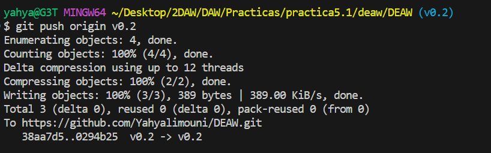

# Práctica 4.1: Configuración de un servidor DNS

## Introducción

En esta práctica, se trabajará con Git y GitHub para aprender y reforzar los conceptos fundamentales del control de versiones, la gestión de ramas

## Enunciado ejercicios Git y GitHub
### Creacion del repositorio
Creamos el repositorio DEAW en Github


Clonamos el repositorio remoto al local


Creamos un README.md, confirmamos los cambios y los subimos


Creamos la carpeta `privada` y el archivo privado.txt

Ignorar la carpeta privada y el archivo privado.txt en `.gitignore` para que no se tengan en cuenta.


Crear un tag con el comando

```git
    git tag v0.1
```

Listamos todos los tags:

```
    git tag
```

Confirmamos los cambios y los subimos


### Cuenta de GitHub

Ponemos una foto de perfil


Activamos el doble factor de autentificación


### Uso social de GitHub

Seguir a 2 colegas


### Crear una tabla
Creamos la tabla en el REAMDE.md


### Colaboradores

Poner a `raul-profesor` como colaborador


### Crear una rama v0.2

Creamos la rama v0.2 y nos posicionamos en ella 


Y la subimos al remoto




### Merge 

Fusionamos la rama v0.2 con main, confirmamos los cambios y los subimos


### Merge con conflicto

1. En la rama master poner Hola en el fichero 1.txt y hacer commit.

2. Posicionarse en la rama v0.2 y poner Adios en el fichero "1.txt" y hacer commit.

3. Posicionarse de nuevo en la rama master y hacer un merge con la rama v0.2


### Listado de ramas

* Listar las ramas con merge y las ramas sin merge.


**--merged**: para listar las ramas fusionadas.

**--no-merged**: para listar las ramas no fusionadas.

### Arreglar conflicto

* Arreglar el conflicto anterior y hacer un commit.

Conflicto resuelto


### Borrar rama

1. Crear un tag v0.2
2. Borrar la rama v0.2

Para borrar una rama se usa el comando: 
```
    git branch -d <rama>
``` 

Y para listar las ramas remotas ejecutamos el comando
```
    git branch -r
```


### Listado de cambios

* Listar los distintos commits con sus ramas y sus tags.


## Ejercicios de creación y actualización de repositorios
### Ejercicio 1

* Configurar Git definiendo el nombre del usuario, el correo electrónico y activar el coloreado de la salida.


Esta config es local, para que sea global añadimos la opción `--global`

* Mostrar la configuración final.

Y para listar toda la config ejecutamos el comando:
```
    git config --list
```


### Ejercicio 2

* Crear un repositorio nuevo con el nombre libro y mostrar su contenido.


### Ejercicio 3:
* Comprobar el estado del repositorio.

* Crear un fichero indice.txt con el siguiente contenido:

```txt
    Capítulo 1: Introducción a Git
    Capítulo 2: Flujo de trabajo básico
    Capítulo 3: Repositorios remotos
```

* Comprobar de nuevo el estado del repositorio.

* Añadir el fichero a la zona de intercambio temporal.

* Volver a comprobar una vez más el estado del repositorio.

Comprobamos el estado del repo


Despues haber cambiado el contenido del index.txt lo agregamos a la zona de intercambio temporal y comprobamos el estado.


### Ejercicio 4

* Realizar un commit de los últimos cambios con el mensaje “Añadido índice del libro.” y ver el estado del repositorio.


### Ejercicio 5
* Cambiar el fichero indice.txt para que contenga lo siguiente:


```txt
    Capítulo 1: Introducción a Git
    Capítulo 2: Flujo de trabajo básico
    Capítulo 3: Gestión de ramas
    Capítulo 4: Repositorios remotos
```

* Mostrar los cambios con respecto a la última versión guardada en el repositorio.

* Hacer un commit de los cambios con el mensaje “Añadido capítulo 3 sobre gestión de ramas”.

1. Cambiamos el cotenido de `index.txt`.

2. 

### Ejercicio 6
* Mostrar los cambios de la última versión del repositorio con respecto a la anterior.

* Cambiar el mensaje del último commit por “Añadido capítulo 3 sobre gestión de ramas al índice.”

* Volver a mostrar los últimos cambios del repositorio.


## Ejercicios de manejo del historial de cambios
### Ejercicio 1

* Mostrar el historial de cambios del repositorio.


* Crear la carpeta capitulos y crear dentro de ella el fichero capitulo1.txt con el siguiente texto. `Git es un sistema de control de versiones ideado por Linus Torvalds.

* Añadir los cambios a la zona de intercambio temporal.

* Hacer un commit de los cambios con el mensaje “Añadido capítulo 1.” Volver a mostrar el historial de cambios del repositorio.


### Ejercicio 2

* Crear el fichero capitulo2.txt en la carpeta capitulos con el siguiente texto. `El flujo de trabajo básico con Git consiste en: 1- Hacer cambios en el repositorio.

* Añadir los cambios a la zona de intercambio temporal. 

* Hacer un commit de los cambios con el mensaje “Añadido capítulo 2.”

* Mostrar las diferencias entre la última versión y dos versiones anteriores.


### Ejercicio 3
* Crear el fichero capitulo3.txt en la carpeta capitulos con el siguiente texto.
`Git permite la creación de ramas lo que permite tener distintas versiones del mismo proyecto y trabajar de manera simultanea en ellas.`

* Añadir los cambios a la zona de intercambio temporal.

* Hacer un commit de los cambios con el mensaje “Añadido capítulo 3.”

* Mostrar las diferencias entre la primera y la última versión del repositorio.


### Ejercicio 4
* Añadir al final del fichero indice.txt la siguiente línea:
`Capítulo 5: Conceptos avanzados`

* Añadir los cambios a la zona de intercambio temporal.

* Hacer un commit de los cambios con el mensaje “Añadido capítulo 5 al índice.”.

* Mostrar quién ha hecho cambios sobre el fichero indice.txt.


# Ejercicios de deshacer cambios

## Ejercicio 1

* Eliminar la última línea del fichero `indice.txt` y guardarlo.
* Comprobar el estado del repositorio.
* Deshacer los cambios realizados en el fichero `indice.txt` para volver a la versión anterior del fichero.
* Volver a comprobar el estado del repositorio.


## Ejercicio 2

* Eliminar la última línea del fichero `indice.txt` y guardarlo.
* Añadir los cambios a la zona de intercambio temporal.
* Comprobar de nuevo el estado del repositorio.
* Quitar los cambios de la zona de intercambio temporal, pero mantenerlos en el directorio de trabajo.
* Comprobar de nuevo el estado del repositorio.
* Deshacer los cambios realizados en el fichero `indice.txt` para volver a la versión anterior del fichero.
* Volver a comprobar el estado del repositorio.


## Ejercicio 3

* Eliminar la última línea del fichero `indice.txt` y guardarlo.
* Eliminar el fichero `capitulos/capitulo3.txt`.
* Añadir un fichero nuevo `capitulos/capitulo4.txt` vacío.
* Añadir los cambios a la zona de intercambio temporal.


* Comprobar de nuevo el estado del repositorio.
* Quitar los cambios de la zona de intercambio temporal, pero mantenerlos en el directorio de trabajo.
* Comprobar de nuevo el estado del repositorio.
* Deshacer los cambios realizados para volver a la versión del repositorio.
* Volver a comprobar el estado del repositorio.


## Ejercicio 4

* Eliminar la última línea del fichero `indice.txt` y guardarlo.
* Eliminar el fichero `capitulos/capitulo3.txt`.
* Añadir los cambios a la zona de intercambio temporal y hacer un commit con el mensaje "Borrado accidental."
* Comprobar el historial del repositorio.
* Deshacer el último commit pero mantener los cambios anteriores en el directorio de trabajo y la zona de intercambio temporal.


* Comprobar el historial y el estado del repositorio.
* Volver a hacer el commit con el mismo mensaje de antes.
* Deshacer el último commit y los cambios anteriores del directorio de trabajo volviendo a la versión anterior del repositorio.
* Comprobar de nuevo el historial y el estado del repositorio.


## Ejercicios de gestión de ramas

### Ejercicio 1

* Crear una nueva rama `bibliografia` y mostrar las ramas del repositorio.


### Ejercicio 2

* Crear el fichero `capitulos/capitulo4.txt` y añadir el texto siguiente:
  
  ```
  En este capítulo veremos cómo usar GitHub para alojar repositorios en remoto.
  ```

* Añadir los cambios a la zona de intercambio temporal.
* Hacer un commit con el mensaje "Añadido capítulo 4."
* Mostrar la historia del repositorio incluyendo todas las ramas.


### Ejercicio 3

* Cambiar a la rama `bibliografia`.
* Crear el fichero `bibliografia.txt` y añadir la siguiente referencia:
  
  ```
  Chacon, S. and Straub, B. Pro Git. Apress.
  ```

* Añadir los cambios a la zona de intercambio temporal.
* Hacer un commit con el mensaje "Añadida primera referencia bibliográfica."
* Mostrar la historia del repositorio incluyendo todas las ramas.


### Ejercicio 4

* Fusionar la rama `bibliografia` con la rama `master`.
* Mostrar la historia del repositorio incluyendo todas las ramas.
* Eliminar la rama `bibliografia`.
* Mostrar de nuevo la historia del repositorio incluyendo todas las ramas.


### Ejercicio 5

* Crear la rama `bibliografia`.
* Cambiar a la rama `bibliografia`.
* Cambiar el fichero `bibliografia.txt` para que contenga las siguientes referencias:
  
  ```
  Scott Chacon and Ben Straub. Pro Git. Apress.
  Ryan Hodson. Ry’s Git Tutorial. Smashwords (2014)
  ```

* Añadir los cambios a la zona de intercambio temporal y hacer un commit con el mensaje "Añadida nueva referencia bibliográfica."
* Cambiar a la rama `master`.
* Cambiar el fichero `bibliografia.txt` para que contenga las siguientes referencias:
  
  ```
  Chacon, S. and Straub, B. Pro Git. Apress.
  Loeliger, J. and McCullough, M. Version control with Git. O’Reilly.
  ```

* Añadir los cambios a la zona de intercambio temporal y hacer un commit con el mensaje "Añadida nueva referencia bibliográfica."
* Fusionar la rama `bibliografia` con la rama `master`.
* Resolver el conflicto dejando el fichero `bibliografia.txt` con las referencias:
  
  ```
  Chacon, S. and Straub, B. Pro Git. Apress.
  Loeliger, J. and McCullough, M. Version control with Git. O’Reilly.
  Hodson, R. Ry’s Git Tutorial. Smashwords (2014)
  ```

* Añadir los cambios a la zona de intercambio temporal y hacer un commit con el mensaje "Resuelto conflicto de bibliografía."
* Mostrar la historia del repositorio incluyendo todas las ramas.


## Ejercicios de repositorios remotos

### Ejercicio 1

* Crear un nuevo repositorio público en GitHub con el nombre `libro-git`.
* Añadirlo al repositorio local del libro.
* Mostrar todos los repositorios remotos configurados.


### Ejercicio 2

* Añadir los cambios del repositorio local al repositorio remoto de GitHub.


* Acceder a GitHub y comprobar que se han subido los cambios mostrando el historial de versiones.


### Ejercicio 3

* Colaborar en el repositorio remoto `libro-git` de otro usuario.
* Clonar su repositorio `libro-git`.
* Añadir el fichero `autores.txt` que contenga el nombre del usuario y su correo electrónico.
  
  ```
  Nombre del usuario - usuario@example.com
  ```

* Añadir los cambios a la zona de intercambio temporal.
* Hacer un commit con el mensaje "Añadido autor."
* Subir los cambios al repositorio remoto.


### Ejercicio 4

* Hacer una bifurcación del repositorio remoto `asalber/libro-git` en GitHub.

Una bifurcación (fork) es una copia de un repositorio que se crea en tu propia cuenta de GitHub. Esto permite hacer cambios sin afectar el repositorio original.


* Clonar el repositorio creado en la cuenta de GitHub del usuario.
* Crear una nueva rama `autoria` y activarla.
* Añadir el nombre del usuario y su correo al fichero `autores.txt`.
  
  ```
  Nombre del usuario - usuario@example.com
  ```

* Añadir los cambios a la zona de intercambio temporal.
* Hacer un commit con el mensaje "Añadido nuevo autor."
* Subir los cambios de la rama `autoria` al repositorio remoto en GitHub.


* Hacer un Pull Request de los cambios en la rama `autoria`.

`Pull Request` es una forma de solicitar que el propietario de un proyecto incorpore los cambios realizados en una rama específica al repositorio principal


